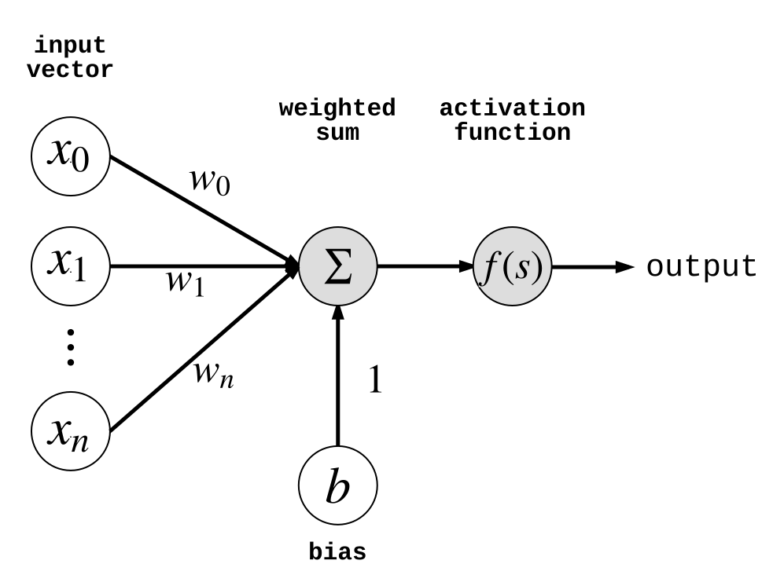
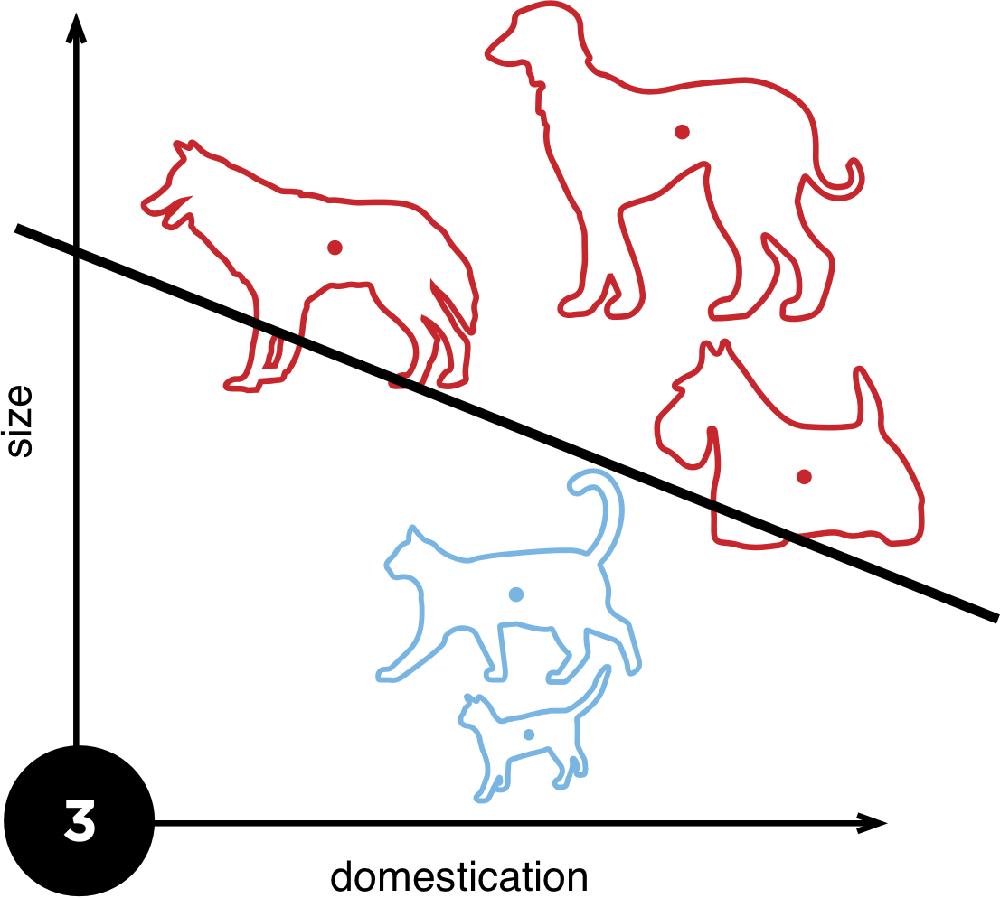
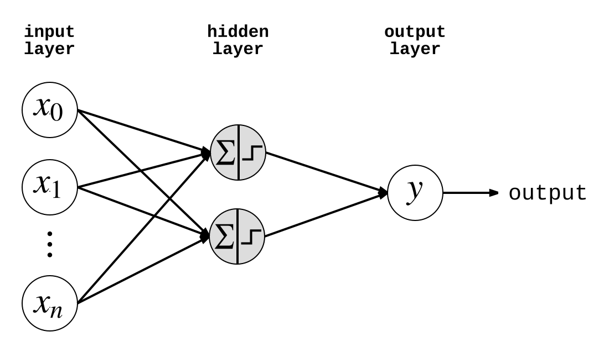
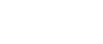
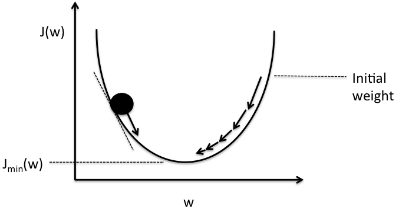
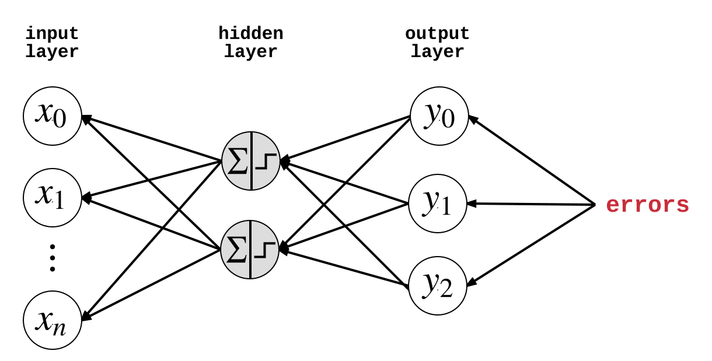
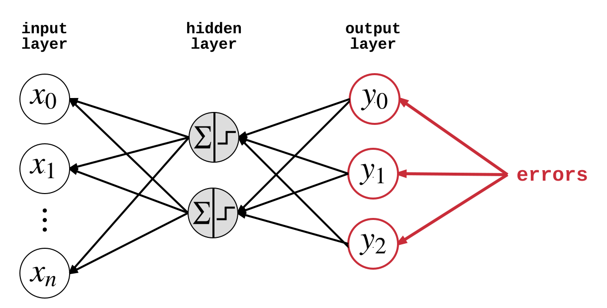
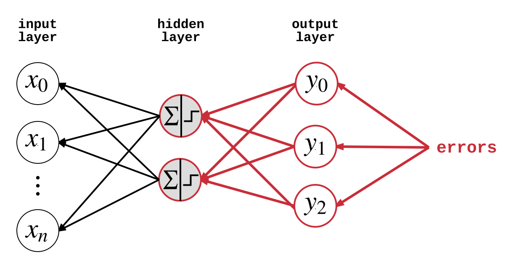
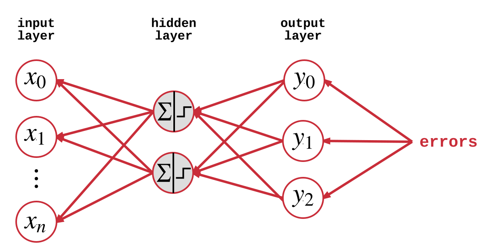

A bit about myself...

[NEXT]
<!-- .slide: data-background="images/bloomberg.jpg" class="stroke large" -->

Infrastructure Engineer

_note_
I currently work for Bloomberg as an infrastructure engineer. I help design
and build the low-level systems that keep financial data moving to the right
places.

My role is essentially a hybrid between a software engineer, architect and
data scientist. I dabble in a bit of everything basically!

[NEXT]
<!-- .slide: data-background="images/stbuk.jpg" class="stroke large" -->

Hackathons

Organiser / Mentor / Hacker

_note_
Have participated in, mentored at and organised 17 hackathons, across the world.

In countries such as: Egypt, UAE, Italy, Germany, the US and, of course, the UK.

[NEXT]

Applied machine learning in:

* network security
* enterprise software management
* employment

_note_
I've applied machine learning to

increase global network security

assist organisations maintain their large, enterprise software estates

and more recently, I've consulted for recruitment startup helper.io

[NEXT SECTION]
## Machine Learning

#### Very Quick Overview

[NEXT]
**Machine learning** is an approach to achieve AI

Machines learn behaviour with little human intervention <!-- .element: class="fragment" data-fragment-index="1" -->

Programs that can adapt when exposed to new data <!-- .element: class="fragment" data-fragment-index="2" -->

Based on pattern recognition <!-- .element: class="fragment" data-fragment-index="3" -->

[NEXT]

_note_
Machine learning has been around for a long time, but industry adoption and
academic research has grown rapidly the past five to ten years.

It's now being used in:

education
security
robotics
finance
speech recognition
image recognition
advertising

[NEXT]
<!-- .slide: data-background="images/ml-landscape-dec15.jpg" -->

_note_
TODO

[NEXT]
### Learning Types

* supervised learning
* unsupervised learning
* semi-supervised learning
* reinforcement learning

Supervised learning will be covered here <!-- .element: class="fragment" data-fragment-index="1" -->

[NEXT]
### Supervised Learning

Use labelled historical data to predict future outcomes

[NEXT]
Given some input data, predict the correct output

What **features** of the input tell us about the output?

[NEXT]
### Feature Space

* A feature is some property that describes raw input data</li>
* Features represented as a vector in **feature space**
* **Abstract** complexity of raw input for easier processing

  

_note_
In this case, we have 2 features, so inputs are 2D vector that lie in
a 2D feature space.

[NEXT]
### Classification

  <ul>
    <li>Training data is used to produce a model</li>
    <li> *f(x&#x0304;)* = *mx&#x0304;* + *c*</li>
    <li>Model divides feature space into segments</li>
    <li>Each segment corresponds to one <strong>output class</strong></li>
  </ul>

  

    

  

  Use trained model to classify new, unseen inputs

[NEXT]
### Model Complexity and Overfitting

[NEXT]

  

    

  

  

    

  

_note_
Now in reality, your data might not be linearly separable, so we might have
to use a more complex model to correctly discriminate between the different
output classes.

Of course, we need to be careful our models don't overfit our input training
data, otherwise it will fail to correctly classify new, unseen data points.

We can see on the diagram on the right, there are many unseen square instances
that have been incorrectly classified as a triangle. The two triangles near
them might just be outliers, but because the model was trained on a small
training dataset, the feature space looked like it had a different structure.

[NEXT]
### Takeaways

* Write programs that convert raw input to feature vectors
* Build a model to divide feature space into classes
  - using training dataset
* Hundreds of model types
* Each divide feature space in different ways

Be careful of overfitting!<!-- .element: class="fragment" data-fragment-index="1" -->

[NEXT SECTION]

## Neural Networks

[NEXT]
<!-- .slide: data-background-video="videos/neuron.mp4" data-background-video-loop="loop" data-background-video-muted -->

_note_
TODO: figure out how to mute, make single neuron video better

[NEXT]
<!-- .slide: data-background-video="videos/neural_networks.mp4" data-background-video-loop="loop" data-background-video-muted -->

_note_
TODO

[NEXT]
### The Mighty Perceptron

* Type of supervised learning model
* Linearly splits feature space
* Modelled after a neuron in the human brain

[NEXT]
<!-- .slide: data-background-color="white" -->

_note_
TODO

[NEXT]
### Perceptron Definition

For `n` features, the perceptron is defined as:

* `n`-dimensional weight vector `w` 
* bias scalar `b`
* activation function `f(x)`

[NEXT]
|              |                                                |
| ------------ | ---------------------------------------------- |
| Input        | $x = \left(x_0, x_1, \cdots, w_n\right)$       |
| Weights      | $w = \left(w_0, w_1, \cdots, w_n\right)$       |
| Bias         | $b$                                            |
| Weighted Sum | $s = \left(\sum_{i=0}^{n} {w_ix_i}\right) + b$ |

[NEXT]
### Activation Function

Simulates the 'firing' of a physical neuron

1 = neuron fired

0 = neuron did not fire

---

$$
  f(x) = \begin{cases}1 & \text{if }s > 0\\\\0
  & \text{otherwise}\end{cases}
$$

$$
  f(x) = \begin{cases}1 & \text{if }w \cdot x + b > 0\\\\0
  & \text{otherwise}\end{cases}
$$

[NEXT]
### Step Function

* Produces binary output from real-valued sum
* Used for for binary classification
  - e.g. Triangle (0) or Square(1)

PLACEHOLDER<!-- .element id="step-activation-function-chart" -->

[NEXT]
### Sigmoid Function

* Can make perceptron produce continuous output
* Useful for regression (predicting continuous values)
  - e.g. temperature

PLACEHOLDER<!-- .element id="all-activation-functions-chart" -->

_note_
We'll find having a continuous activation function very useful for when we
combine many perceptrons together. 

[NEXT]
How do we **learn** `w` and `b`?

[NEXT]
### Perceptron Learning Algorithm

Algorithm which learns correct weights and bias

Use training dataset to incrementally train perceptron

Guaranteed to create line that divides output classes

(if data is linearly separable)<!-- .element class="small" -->

_note_
Details of the algorithm are not covered here for brevity.

Training dataset, which is a collection of known input/output pairs
(typically produced by humans manually labelling input).

[NEXT]
<!-- .slide: data-background-color="white" data-transition="none" -->

[NEXT]
<!-- .slide: data-background-color="white" data-transition="none" -->

[NEXT]
<!-- .slide: data-background-color="white" data-transition="none" -->

[NEXT]
<!-- .slide: data-background-color="white" data-transition="none" -->

[NEXT]
### Problem

Most data is not linearly separable

Need a *network* of neurons to discriminate non-linear data

[NEXT]
### Feed-Forward Neural Networks

Most common neural network architecture

Provides classification or regression

Uses *multiple* perceptrons in a layered fashion

[NEXT]
<!-- .slide: data-background-color="white" -->

[NEXT]
<!-- .slide: data-background-color="white" -->

[NEXT]
### Architecture for Classification

|        |   |
| ------ | - |
| Input  | `n` nodes, set to the value of each feature |
| Hidden | where the magic happens |
| Output | `m` nodes, set to probability input is in a class |

where `n` is feature count and `m` is class count.

_note_
The hidden layers is where all the smarts comes in. I could spend days
discussing how to choose the number of hidden layers and nodes in each
layer.

It depends on so many factors. The number of input features, the distribution
of inputs across feature space. 

[NEXT]
### Neuron Connectivity

* Each layer is **fully connected** to the next
* All nodes in layer $l$ are connected to nodes in layer $l + 1$
* Every single connection has a weight

_note_
Standard neural network architectures make each layer fully connected
to the next. 

[NEXT]
Produces a **weight matrix**

(also: no more biases)<!-- .element class="small" -->

_note_
Weight matrix produced using the following Latex equation:
W = \begin{bmatrix} w_{00} & w_{01} & \cdots & w_{0n} \\ w_{10} & w_{11} & \cdots & w_{1n} \\ \vdots & \vdots & \vdots & \vdots \\ w_{m0} & w_{m1} & \cdots & w_{mn} \end{bmatrix}

[NEXT]
### Non-Linearity

* **Hidden** layers used to separate non-linear data
* Linear activation functions means network is linear
* Use n-linear activation functions instead (e.g. sigmoid)

PLACEHOLDER<!-- .element id="sigmoid-activation-function-chart" -->

[NEXT]
### Training FFNNs

Learn the **weight matrix**!

[NEXT]
* Define a **loss function**
  - higher output means network is making more errors
* Learn the weight matrix that minimises this function
* Use **gradient descent** to do this

[NEXT]
### Gradient Descent Optimiser

Keep adjusting neuron weights

Such that loss/error function is minimised

Uses derivatives of activation functions to adjust weights

So we need continuous activation functions like sigmoid!

[NEXT]
<!-- .slide: data-background-color="white" class="small low-padding" -->

|               |              |
| ------------- | ------------ |
| Weight matrix | $w$          |
| Loss function | $J(w)$       |
| Loss minmina  | $J_{min}(w)$ |

_note_
We can describe the principle behind gradient descent as “climbing down a
hill” until a local or global minimum is reached.

At each step, we take a step into the opposite direction of the gradient.

The step size is determined by the value of the **learning rate** as well
as the slope of the gradient.

Source of diagram: http://sebastianraschka.com/Articles/2015_singlelayer_neurons.html#gradient-descent

[NEXT]
### Backpropagation

* Equivalent to gradient descent
* *The* training algorithm for neural networks
* For each feature vector in the training dataset, do a:
  1. forward pass
  2. backward pass

_note_
Backpropagation is the workhorse of neural network training. Some
variation of this algorithm is almost always used to train nets.

For a data point in our training dataset, we run two steps.

Visualisation of learning by backpropagation:
http://www.emergentmind.com/neural-network

[NEXT]
<!-- .slide: data-background-color="white" data-transition="none" -->
### Forward Pass

_note_
1. Start with random weights
2. Feed input feature vector to input layer
3. Let the first layer evaluate their activation using
4. Feed activation into next layer, repeat for all layers
5. Finally, compute output layer values

[NEXT]
<!-- .slide: data-background-color="white" data-transition="none" -->
### Forward Pass

[NEXT]
<!-- .slide: data-background-color="white" data-transition="none" -->
### Forward Pass

[NEXT]
<!-- .slide: data-background-color="white" data-transition="none" -->
### Forward Pass

[NEXT]
<!-- .slide: data-background-color="white" data-transition="none" -->
### Backward Pass

_note_
1. Compare the target output to the actual output
  - calculate the errors of the output neurons
2. Calculate weight updates associated with output neurons using perceptron learning principle
  - same adjustments as the ones made in the Perceptron Algorithm)
3. For each output neuron, propagate values back to the previous layer
4. Calculate weight updates associated with hidden neurons using perceptron learning principle
5. Update weights, then repeat from step 1 (performing another forward and backward pass) until the weight values converge

[NEXT]
<!-- .slide: data-background-color="white" data-transition="none" -->
### Backward Pass

[NEXT]
<!-- .slide: data-background-color="white" data-transition="none" -->
### Backward Pass

[NEXT]
<!-- .slide: data-background-color="white" data-transition="none" -->
### Backward Pass

[NEXT]
After training the network, we obtain weights which minimise the loss/error 

Classify new, unseen inputs by running them through the **forward pass** step

[NEXT]
Many types of gradient descent / backpropagation

Batch, mini-batch, stochastic

[Overview of Gradient Descent Optimisation Algorithms](http://sebastianruder.com/optimizing-gradient-descent/)

_note_
There are many types of gradient descent for optimising weight matrices
and minimising loss. We don't have the time to go through them here. Here's
a link to amazing blog post that does an excellent job of summarising the
different types of gradient descent optimisers.

[NEXT]
### Universal Approximation Theorem

> A feed-forward neural network with a single hidden layer that has a finite
> number of nodes, can approximate any continuous function

[NEXT]
### Limitations in Practice

TODO: feature engineering + data cleaning (latter is an aside)

[NEXT SECTION]
## Deep Learning
#### What is It?

A machine learning technique

Based on neural networks

**Learns** the input features for you

[NEXT]
<!-- .slide: data-background="images/nvidia_deep_learning.png" -->

[NEXT]
### Issues with Deep Learning
##### (until 2006)

* Computationally expensive to train
* Models have a tendency to overfit training data
* Lack of *convergence* in weights
* Meant deep networks were useless in the real world
    - no better than random initialisation of weights

_note_
The earliest layers in a deep network simply weren't learning useful
representations of the data. In many cases they weren't learning anything
at all.

Instead they were staying close to their random weight initialisation because
of the nature of backpropagation. This meant the deep networks were completely
useless when used on real world data. They just didn't generalise at all.

[NEXT]
### Resurgence of Neural Networks

2006 and beyond

<table>
    <tr>
        <td></td>
        <td></td>
        <td></td>
    </tr>
    <tr>
        <td>Geoff Hinton</td>
        <td>Yann Lecun</td>
        <td>Yoshua Bengio</td>
    </tr>
    <tr>
        <td>Restricted Boltzmann Machine</td>
        <td>Sparse Representations</td>
        <td>Stacked Autoencoders</td>
    </tr>
</table>

_note_
In 2006 three separate groups developed ways of overcoming the difficulties
that many in the machine learning world encountered while trying to train
deep neural networks. The leaders of these three groups are the fathers of
the age of deep learning. 

Before their work, the earliest layers in a deep network simply weren’t
learning useful representations of the data. In many cases they weren’t
learning anything at all.

Using different techniques, each of these three groups was able to get these
early layers to learn useful representations, which led to much more powerful
neural networks.

[NEXT]
### Resurgence of Neural Networks

Google's usage that popularised it (TODO: get usage)

[NEXT]
### Modern Uses of Deep Learning

Widely used in image recognition

TODO: examples (driver-less cards and two others)

[NEXT]
### Other Factors

* cheaper computing power and data storage
* more data than ever &dash; everyone is online
* GPGPUs

[NEXT]
#### Projected Deep Learning Software Revenue

Placeholder<!-- .element id="deep-learning-growth-chart" -->  

[Source: Tractica](http://bit.ly/1Sufnue) <!-- .element class="small" -->

[NEXT]
> Annual revenue for deep learning will surpass **$10 billion** by 2014

_note_
The market intelligence firm forecasts that annual software revenue for
enterprise applications of deep learning will increase from $109 million
in 2015 to $10.4 billion in 2024.

I suspect this large growth is because of deep learning's application in
driver-less cars, which is going to become a *huge* industry.

[NEXT]
TODO

[NEXT SECTION]
## Deep Learning

#### Technical Overview

[NEXT]
TODO

[NEXT SECTION]
## Tensorflow
#### Deep Learning in Practice

[NEXT]
TODO

[NEXT SECTION]
## Summary

[NEXT]
TODO

[NEXT SECTION]
### Futher Reading

[Neural Network FAQs](http://www.faqs.org/faqs/ai-faq/neural-nets/)

### Slides

[http://donaldwhyte.co.uk/intro-to-deeplearning](http://donaldwhyte.co.uk/intro-to-deeplearning)

[NEXT]
### Get In Touch

  

  

[donaldwhyte0@gmail.com](mailto:donaldwhyte0@gmail.com)

[@donald_whyte](http://twitter.com/donald_whyte)

[GitHub](http://github.com/DonaldWhyte)
  

</section>
