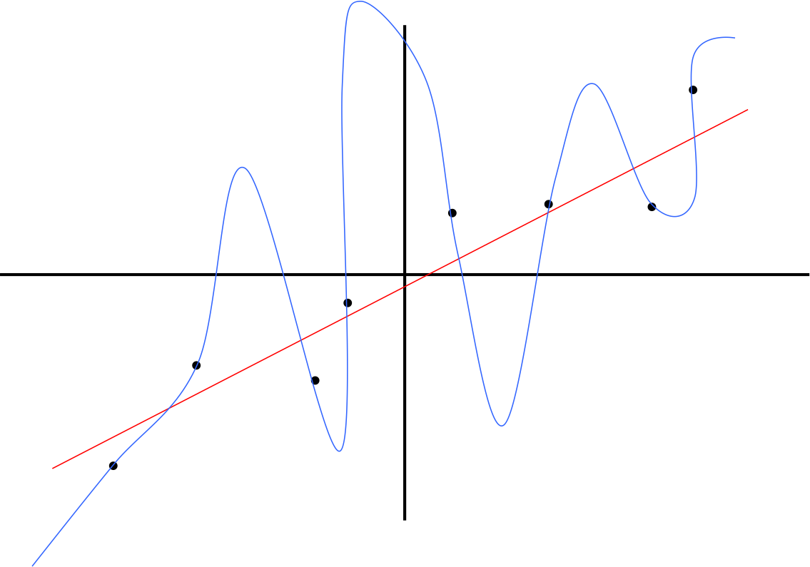
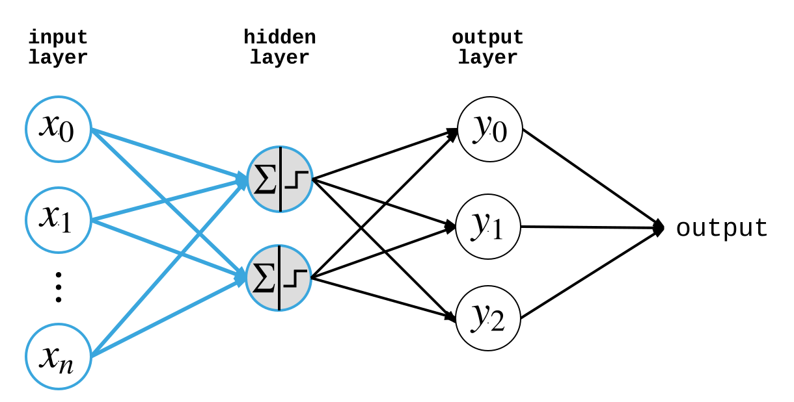
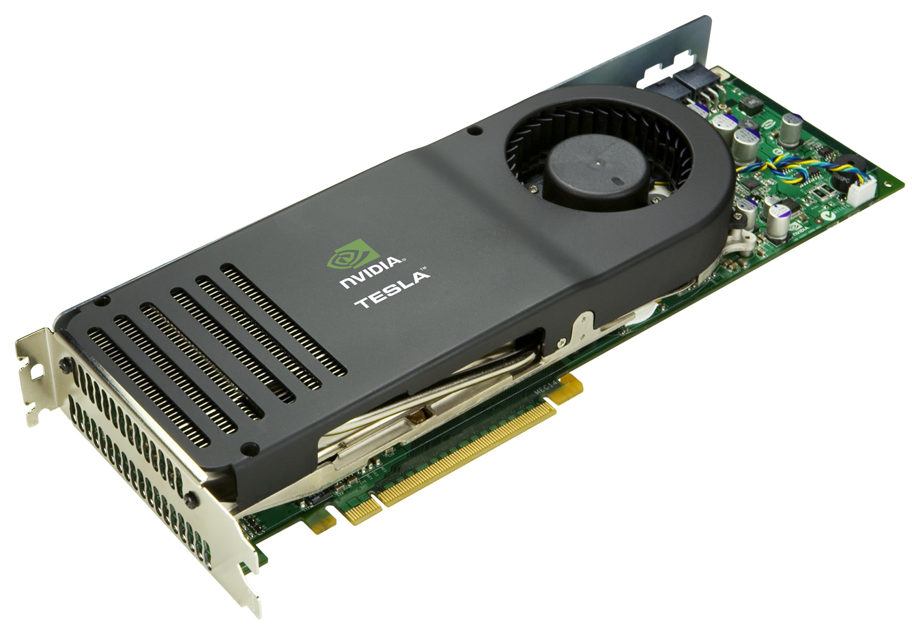
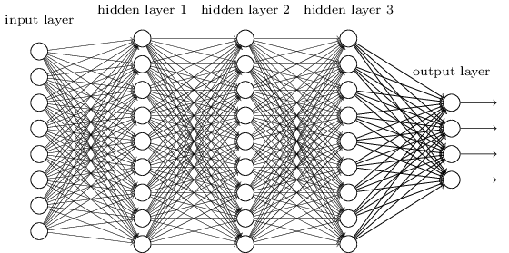

## Introduction to Deep Learning

[@donald_whyte](http://twitter.com/donald_whyte)

<div id="logo-notice">
  <p>Originally made for:</p>

  
</div>


[NEXT SECTION]
A bit about myself...

[NEXT]
<!-- .slide: data-background="images/bloomberg.jpg" class="stroke large" -->


Infrastructure Engineer

_note_
I currently work for Bloomberg as an infrastructure engineer. I help design
and build the low-level systems that keep financial data moving to the right
places.

My role is essentially a hybrid between a software engineer, architect and
data scientist. I dabble in a bit of everything basically!

[NEXT]
<!-- .slide: data-background="images/stbuk.jpg" class="stroke large" -->

Hackathons

Organiser / Mentor / Hacker

_note_
Have participated in, mentored at and organised 17 hackathons, across the world.

In countries such as: Egypt, UAE, Italy, Germany, the US and, of course, the UK.

[NEXT]


Applied machine learning in:

* network security
* enterprise software defect detection
* employment

_note_
I've applied machine learning to

increase global network security

automatically detect defects in large-scale software systems

and more recently, I've consulted for recruitment startup helper.io


[NEXT SECTION]
## Machine Learning

#### Very Quick Overview

[NEXT]
**Machine learning** is an approach to achieve AI

Machines learn behaviour with little human intervention <!-- .element: class="fragment" data-fragment-index="1" -->

Programs that can adapt when exposed to new data <!-- .element: class="fragment" data-fragment-index="2" -->

Based on pattern recognition <!-- .element: class="fragment" data-fragment-index="3" -->

[NEXT]


_note_
Machine learning has been around for a long time, but industry adoption and
academic research has grown rapidly the past five to ten years.

It's now being used in:

education
security
robotics
finance
speech recognition
image recognition
advertising

[NEXT]
<!-- .slide: data-background="images/ml-landscape-dec15.jpg" -->

_note_
Nowadays, machine learning is everywhere. You can't avoid it.

When you look on Facebook, machine learning determines what you see. When you
pay for your lunch with your credit card, machine learning decides whether the
transaction goes through, or if you're a fraud.

Global markets are affected by the machine learning algorithms hedge funds
execute.

Behind me is a tiny portion of the machine learning focused companies out there
today. ML has spurred innovation in dozens of industries, and it's slowly
Touching more and more.

[NEXT]
### Learning Types

* supervised learning
* unsupervised learning
* semi-supervised learning
* reinforcement learning

Supervised learning will be covered here <!-- .element: class="fragment" data-fragment-index="1" -->

[NEXT]
### Supervised Learning

Use labelled historical data to predict future outcomes

[NEXT]
Given some input data, predict the correct output


What **features** of the input tell us about the output?

[NEXT]
### Feature Space

* A feature is some property that describes raw input data</li>
* Features represented as a vector in **feature space**
* **Abstract** complexity of raw input for easier processing

<center>
  <div id="shape-plot"></div>
</center>

_note_
In this case, we have 2 features, so inputs are 2D vector that lie in
a 2D feature space.

[NEXT]
### Classification

<div class="left-col">
  <ul>
    <li>Training data is used to produce a model</li>
    <li> *f(x&#x0304;)* = *mx&#x0304;* + *c*</li>
    <li>Model divides feature space into segments</li>
    <li>Each segment corresponds to one <strong>output class</strong></li>
  </ul>
</div>

<div class="right-col">
  <center>
    <div id="shape-plot-discriminant"></div>
  </center>
</div>

<div class="clear-col"></div>

<p>
  Use trained model to classify new, unseen inputs
</p>

[NEXT]
### Model Complexity and Overfitting

[NEXT]
<div class="left-col">
  <center>
    <div id="shape-plot-complex"></div>
  </center>
</div>
<div class="right-col fragment" data-fragment="1">
  <center>
    <div id="shape-plot-overfitting"></div>
  </center>
</div>

_note_
Now in reality, your data might not be linearly separable, so we might have
to use a more complex model to correctly discriminate between the different
output classes.

Of course, we need to be careful our models don't overfit our input training
data, otherwise it will fail to correctly classify new, unseen data points.

We can see on the diagram on the right, there are many unseen square instances
that have been incorrectly classified as a triangle. The two triangles near
them might just be outliers, but because the model was trained on a small
training dataset, the feature space looked like it had a different structure.

[NEXT]
<!-- .slide: data-background-color="white" -->


[NEXT]
### Takeaways

* Write programs that convert raw input to feature vectors
* Build a model to divide feature space into classes
  - using training dataset
* Hundreds of model types
* Each divide feature space in different ways

Be careful of overfitting!<!-- .element: class="fragment" data-fragment-index="1" -->

[NEXT SECTION]

## Neural Networks

[NEXT]
<!-- .slide: data-background-video="videos/neuron.mp4" data-background-video-loop="loop" data-background-video-muted -->

_note_
TODO

[NEXT]
<!-- .slide: data-background-video="videos/neural_networks.mp4" data-background-video-loop="loop" data-background-video-muted -->

_note_
TODO

[NEXT]
### The Mighty Perceptron

* Type of supervised learning model
* Linearly splits feature space
* Modelled after a neuron in the human brain

[NEXT]
<!-- .slide: data-background-color="white" -->


[NEXT]
### Perceptron Definition

For `n` features, the perceptron is defined as:

* `n`-dimensional weight vector `w` 
* bias scalar `b`
* activation function `f(x)`

[NEXT]
|              |                                                |
| ------------ | ---------------------------------------------- |
| Input        | $x = \left(x_0, x_1, \cdots, w_n\right)$       |
| Weights      | $w = \left(w_0, w_1, \cdots, w_n\right)$       |
| Bias         | $b$                                            |
| Weighted Sum | $s = \left(\sum_{i=0}^{n} {w_ix_i}\right) + b$ |


[NEXT]
### Activation Function

Simulates the 'firing' of a physical neuron

1 = neuron fired

0 = neuron did not fire

---

<div class="fragment fade-in" data-fragment-index="1">
<div class="fragment fade-out" data-fragment-index="2">
$$
  f(x) = \begin{cases}1 & \text{if }s > 0\\\\0
  & \text{otherwise}\end{cases}
$$
</div>
</div>

<div class="fragment fade-in" data-fragment-index="2">
$$
  f(x) = \begin{cases}1 & \text{if }w \cdot x + b > 0\\\\0
  & \text{otherwise}\end{cases}
$$
</div>

[NEXT]
### Step Function

* Produces binary output from real-valued sum
* Used for for binary classification
  - e.g. Triangle (0) or Square(1)

PLACEHOLDER<!-- .element id="step-activation-function-chart" -->

[NEXT]
### Sigmoid Function

* Can make perceptron produce continuous output
* Useful for regression (predicting continuous values)
  - e.g. temperature

PLACEHOLDER<!-- .element id="all-activation-functions-chart" -->

_note_
We'll find having a continuous activation function very useful for when we
combine many perceptrons together. 

[NEXT]
How do we **learn** `w` and `b`?

[NEXT]
### Perceptron Learning Algorithm

Algorithm which learns correct weights and bias

Use training dataset to incrementally train perceptron

Guaranteed to create line that divides output classes

(if data is linearly separable)<!-- .element class="small" -->

_note_
Details of the algorithm are not covered here for brevity.

Training dataset, which is a collection of known input/output pairs
(typically produced by humans manually labelling input).

[NEXT]
<!-- .slide: data-background-color="white" data-transition="none" -->


[NEXT]
<!-- .slide: data-background-color="white" data-transition="none" -->


[NEXT]
<!-- .slide: data-background-color="white" data-transition="none" -->


[NEXT]
<!-- .slide: data-background-color="white" data-transition="none" -->


[NEXT]
### Problem

Most data is not linearly separable

Need a *network* of neurons to discriminate non-linear data

[NEXT]
### Feed-Forward Neural Networks

Most common neural network architecture

Provides classification or regression

Uses *multiple* perceptrons in a layered fashion

[NEXT]
<!-- .slide: data-background-color="white" -->


[NEXT]
<!-- .slide: data-background-color="white" -->


[NEXT]
### Architecture for Classification

|        |   |
| ------ | - |
| Input  | `n` nodes, set to the value of each feature |
| Hidden | where the magic happens |
| Output | `m` nodes, set to probability input is in a class |

where `n` is feature count and `m` is class count.

_note_
The hidden layers is where all the smarts comes in. I could spend days
discussing how to choose the number of hidden layers and nodes in each
layer.

It depends on so many factors. The number of input features, the distribution
of inputs across feature space. 

[NEXT]
### Neuron Connectivity

* Each layer is **fully connected** to the next
* All nodes in layer $l$ are connected to nodes in layer $l + 1$
* Every single connection has a weight

_note_
Standard neural network architectures make each layer fully connected
to the next. 

[NEXT]
Produces a **weight matrix**


(also: no more biases)<!-- .element class="small" -->

_note_
Weight matrix produced using the following Latex equation:
W = \begin{bmatrix} w_{00} & w_{01} & \cdots & w_{0n} \\ w_{10} & w_{11} & \cdots & w_{1n} \\ \vdots & \vdots & \vdots & \vdots \\ w_{m0} & w_{m1} & \cdots & w_{mn} \end{bmatrix}

[NEXT]
### Non-Linearity

* **Hidden** layers used to separate non-linear data
* Linear activation functions means network is linear
* Use n-linear activation functions instead (e.g. sigmoid)

PLACEHOLDER<!-- .element id="sigmoid-activation-function-chart" -->

[NEXT]
### Training FFNNs

Learn the **weight matrix**!

[NEXT]
* Define a **loss function**
  - higher output means network is making more errors
* Learn the weight matrix that minimises this function
* Use **gradient descent** to do this

[NEXT]
### Gradient Descent Optimiser

Keep adjusting neuron weights

Such that loss/error function is minimised

Uses derivatives of activation functions to adjust weights

So we need continuous activation functions like sigmoid!

[NEXT]
<!-- .slide: data-background-color="white" class="small low-padding" -->


|               |              |
| ------------- | ------------ |
| Weight matrix | $w$          |
| Loss function | $J(w)$       |
| Loss minima  | $J_{min}(w)$ |

_note_
We can describe the principle behind gradient descent as “climbing down a
hill” until a local or global minimum is reached.

At each step, we take a step into the opposite direction of the gradient.

The step size is determined by the value of the **learning rate** as well
as the slope of the gradient.

Source of diagram: http://sebastianraschka.com/Articles/2015_singlelayer_neurons.html#gradient-descent

[NEXT]

Mean squared error loss function:

$ J(w) = \frac {1} {n} \sum_{i=i}^N {(y_i - t_i)^2} $

where:

* $N$ is the number of inputs in your test dataset
* for each training sample $i$:
  - $y_i$ is a vector storing the values of each output node
  - $t_i$ is a vector storing the *known, correct* outputs

_note_
Note that this function is evaluated for *every* single point run through the training dataset!

[NEXT]
### Backpropagation

* Equivalent to gradient descent
* *The* training algorithm for neural networks
* For each feature vector in the training dataset, do a:
  1. forward pass
  2. backward pass

_note_
Backpropagation is the workhorse of neural network training. Some
variation of this algorithm is almost always used to train nets.

For a data point in our training dataset, we run two steps.

Visualisation of learning by backpropagation:
http://www.emergentmind.com/neural-network

[NEXT]
<!-- .slide: data-background-color="white" data-transition="none" -->
### Forward Pass


_note_
1. Start with random weights
2. Feed input feature vector to input layer
3. Let the first layer evaluate their activation using
4. Feed activation into next layer, repeat for all layers
5. Finally, compute output layer values

[NEXT]
<!-- .slide: data-background-color="white" data-transition="none" -->
### Forward Pass


[NEXT]
<!-- .slide: data-background-color="white" data-transition="none" -->
### Forward Pass


[NEXT]
<!-- .slide: data-background-color="white" data-transition="none" -->
### Forward Pass


[NEXT]
<!-- .slide: data-background-color="white" data-transition="none" -->
### Backward Pass


_note_
1. Compare the target output to the actual output
  - calculate the errors of the output neurons
2. Calculate weight updates associated with output neurons using perceptron learning principle
  - same adjustments as the ones made in the Perceptron Algorithm)
3. For each output neuron, propagate values back to the previous layer
4. Calculate weight updates associated with hidden neurons using perceptron learning principle
5. Update weights, then repeat from step 1 (performing another forward and backward pass) until the weight values converge

[NEXT]
<!-- .slide: data-background-color="white" data-transition="none" -->
### Backward Pass


[NEXT]
<!-- .slide: data-background-color="white" data-transition="none" -->
### Backward Pass


[NEXT]
<!-- .slide: data-background-color="white" data-transition="none" -->
### Backward Pass


[NEXT]
After training the network, we obtain weights which minimise the loss/error 

Classify new, unseen inputs by running them through the **forward pass** step

[NEXT]
Many types of gradient descent / backpropagation

Batch, mini-batch, stochastic

[Overview of Gradient Descent Optimisation Algorithms](http://sebastianruder.com/optimizing-gradient-descent/)

_note_
There are many types of gradient descent for optimising weight matrices
and minimising loss. We don't have the time to go through them here. Here's
a link to amazing blog post that does an excellent job of summarising the
different types of gradient descent optimisers.

[NEXT]
### Universal Approximation Theorem

> A feed-forward neural network with a single hidden layer that has a finite
> number of nodes, can approximate any continuous function

[NEXT]
### Limitations of Shallow Networks

* Complex data requires thousands of neurons in the hidden layer
* Computationally expensive to train large networks
* Complex models have a tendency to overfit training data
* No way of understanding what's going on inside the large hidden layer

_note_
Despite it being *theoretically* possible for single layer neural networks to approximate *any* function and split *any* feature space, it turned out
creating such networks was not practical.

The networks either took *way* too long to train or overfit the training data.
In other words, researchers couldn't find a way to build single layer networks
that *generalised* to unseen data.

[NEXT]
### Feature Engineering

* Most shallow networks required data to be pre-processing
  - i.e. feature extraction
* Hand-crafting features is a time-consuming, human-driven process 
* *Real* intelligence was still in the human who chose the features

[NEXT]
Why not turn to deep learning?


[NEXT SECTION]
## Deep Learning
### What Is It and Why Now?

[NEXT]
A machine learning technique

Neural networks with many hidden layers

**Learns** the input features for you

[NEXT]
<!-- .slide: data-background="images/nvidia_deep_learning.png" -->

[NEXT]
<!-- .slide: data-background-color="white" -->
<!-- .slide: data-background="images/hierarchical_learning.jpg" -->
<!-- .slide: data-background-size="800px" -->

_note_
Why does deep learning work? Why is it better than one-layer shallow networks?

TOOD

[NEXT]
### Core Issue with Deep Learning
##### (until 2006)

* Backpropagation could not train deep networks
* Lack of convergence of weights in early layers
* Vanishing gradient problem
* Deep networks contain much more neurons/connections
  - very expensive to train

_note_
Early layers' weights were no better than random initialisation.

The earliest layers in a deep network simply weren't learning useful
representations of the data. In many cases they weren't learning anything
at all.

Instead they were staying close to their random weight initialisation because
of the nature of backpropagation. This meant the deep networks were completely
useless when used on real world data. They just didn't generalise at all.

This was due to the **vanishing gradient problem**. This happens because
backpropagation involves a sequence of multiplications that invariably
result in smaller derivatives for earlier layers.

[NEXT]
### Resurgence of Neural Networks
#### (2006 and beyond)

<table class="centered-text borderless">
    <tr>
        <td></td>
        <td></td>
        <td></td>
    </tr>
    <tr>
        <td>Geoff Hinton</td>
        <td>Yann Lecun</td>
        <td>Yoshua Bengio</td>
    </tr>
</table>

_note_
In 2006 three separate groups developed ways of overcoming the difficulties
that many in the machine learning world encountered while trying to train
deep neural networks. The leaders of these three groups are the fathers of
the age of deep learning. 

Before their work, the earliest layers in a deep network simply weren't
learning useful representations of the data. In many cases they weren't
learning anything at all.

Using different techniques, each of these three groups was able to get these
early layers to learn useful representations, which led to much more powerful
neural networks.

[NEXT]

### Why Did Traditional Backpropagation Not Work?

1. Our labelled datasets were thousands of times too small
2. Our computers were millions of times too slow
3. We initialized the weights in a stupid way
4. We used the wrong type of non-linearity

_note_
So, why indeed, did purely supervised learning with backpropagation not work well in the past? Geoffrey Hinton summarized the findings up to today in these four points:

Source: http://www.andreykurenkov.com/writing/a-brief-history-of-neural-nets-and-deep-learning-part-4/

[NEXT]
### Why It Works Now
#### (1) Massive Datasets Available

Thanks to Google, Amazon, Microsoft, etc.

Everyone is on the web

Everyone's data is captured

[NEXT]
### Why It Works Now
#### (2) Distributed Training of Networks

Backpropagation can be reduced to matrix multiplication

Easily parallelised and distributed across multiple cores

GPGPU and distributed computation




[NEXT]
### Why It Works Now
#### (3) Better Weight Initialisation

* Blindly choosing random weights caused problems
* If **same scale** was used for weights in each layer, we get:
  - vanishing gradient problem

<div class="fragment" data-fragment-index="1">
  <br />
  <h4>
    Solution?
  </h4>
</div>

<div class="fragment" data-fragment-index="2">
  <p>
    Higher weight magnitudes and variance in earlier layers!
  </p>
</div>

_note_
It was not so much choosing random weights that was problematic, as choosing
random weights without consideration for which layer the weights are for.

That is, unless weights are chosen with difference scales according to the layer they are in, we get the vanishing gradient problem.

Give higher weight magnitudes and variance in earlier layers significantly
reduces the changes of hitting the vanishing gradient problem.

[NEXT]
### Why It Works Now
#### (4) Better Activation Functions
PLACEHOLDER<!-- .element id="modern-activation-functions-chart" -->

[NEXT]
### Modern Uses of Deep Learning

Widely used for image and sound processing

Both recognition and generation


_note_
Image recognition: Google ImageNet
Speech synthesis: Google DeepMind WaveNet

An important thing to note is that deep learning enables more than
just recognition. It enables the *generation* of content as well. This
capability is beyond most machine learning techniques.

[NEXT]
#### Projected Deep Learning Software Revenue

Placeholder<!-- .element id="deep-learning-growth-chart" -->  

[Source: Tractica](http://bit.ly/1Sufnue) <!-- .element class="small" -->

[NEXT]
> Annual revenue for deep learning will surpass **$10 billion** by 2014

_note_
The market intelligence firm forecasts that annual software revenue for
enterprise applications of deep learning will increase from $109 million
in 2015 to $10.4 billion in 2024.

I suspect this large growth is because of deep learning's application in
driver-less cars, which is going to become a *huge* industry.


[NEXT SECTION]
## Deep Learning

### By Example

[NEXT]
<!-- .slide: data-background="images/higgs_boson.jpg" -->
<!-- .slide: class="stroke large" -->
Higgs Boson Detection

[NEXT]
### What is the Higgs Boson?

* Last unobserved particle in the Standard Model of physics
* Its discovery is the "ultimate verification" of the Standard Model
* 40 year effort by the scientific community
* March 2013:
  - the Higgs boson was officially confirmed to exist

[NEXT]
### Finding a Higgs Boson Particle

Vast amounts of energy required to create them

Large Hadron Collider used to produce this energy

_note_
It is difficult to detect the Higgs Boson because of their massive size
(compared with other particles). We need vast amounts of energy to create
them.
The Large Hadron Collider at CERN gave us enough energy to create them.

[NEXT]
<!-- .slide: data-background="images/large_hadron_collider.jpg" -->
<!-- .slide: class="stroke large" -->
Large Hadron Collider

_note_
Built by CERN in Switzerland, the Large Hadron Collider is capable
of producing the vast amount of energy required to run complex particle
physics simulations.

[NEXT]
<!-- .slide: data-background-color="white" -->
<!-- .slide: data-background-image="images/lhc_experiment_visualisation.jpg" -->
<!-- .slide: data-background-size="600px" -->

[NEXT]
### Process

1. accelerate two sets of particles 
2. set them on a path to collide with each other
3. monitor *effect* of collision using detectors
4. if right effect occurs, a Higgs boson was produced

Use measurements of effects to infer Higgs boson production!
<!-- .element data-fragment-index="1" class="fragment" -->

_note_
2:
Each collision produces a flurry of new particles which are detected by 
etectors around the point where they collide.

There is still only a very small chance, one in 10 billion, of a Higgs Boson appearing and being detected, so the LHC needs to smash together trillions of
particals.

Supercomputers the need to sift through a massive amount of data to find the
few collisions where evidence of the Higgs boson is.

3 - 4:
However, even when a Higgs boson, or any interesting particle is produced,
detecting them poses considerable challenges. They are too small to be
directly observed and decay almost immediately into other particles.

Though new particles cannot be directly observed, the lighter stable particles
to which they decay, called decay products, can be observed. 

Multiple layers of detectors surround the point of collision for this purpose. 
The detects measure the direction and momentum of each decay product to be
measured.

So we use the measurements of the stable particles to *infer* the creation of
a Higgs boson!


[NEXT]
### Higgs Boson as Classification

* Classification problem
* Detect when a particle collision produces a Higgs boson
* Two classes:
  - signal (collision that created a Higgs boson)
  - background (collision that did not)

_note_
The vast majority of particle collisions do not produce exotic particles.
For example, though the Large Hadron Collider produces approximately 1011
collisions per hour, approximately 300 of these collisions result in a
Higgs boson, on average.

Therefore, good data analysis depends on distinguishing collisions which
produce particles of interest (signal) from those producing other
particles.

[NEXT]
### Training Dataset

* Synthetic
* Monte Carlo simulations generated input/output pairs
* Input contains:
  - kinematic properties
  - measured by particle detectors in the LHC
* Output is a binary value:
  - 1 if Higgs boson produced, 0 otherwise
* 10,500,000 training data points
* 500,000 test

[NEXT]

```
Class,                    Feature 1,                Feature 2,                Feature 3,                 Feature 4,                Feature 5,                 ...                                                                                                                                                                                                                                                                                                                                                                                                                                                                                                                                                                                                Feature 28
1.000000000000000000e+00, 8.692932128906250000e-01, -6.350818276405334473e-01, 2.256902605295181274e-01, 3.274700641632080078e-01, -6.899932026863098145e-01, 7.542022466659545898e-01, -2.485731393098831177e-01, -1.092063903808593750e+00, 0.000000000000000000e+00, 1.374992132186889648e+00, -6.536741852760314941e-01, 9.303491115570068359e-01, 1.107436060905456543e+00, 1.138904333114624023e+00, -1.578198313713073730e+00, -1.046985387802124023e+00, 0.000000000000000000e+00, 6.579295396804809570e-01, -1.045456994324922562e-02, -4.576716944575309753e-02, 3.101961374282836914e+00, 1.353760004043579102e+00, 9.795631170272827148e-01, 9.780761599540710449e-01, 9.200048446655273438e-01, 7.216574549674987793e-01, 9.887509346008300781e-01, 8.766783475875854492e-01
1.000000000000000000e+00, 1.159911632537841797e+00, 1.013847351074218750e+00, 1.086145266890525818e-01, 1.495523571968078613e+00, -5.375448465347290039e-01, 2.342396497726440430e+00, -8.397403955459594727e-01, 1.320682883262634277e+00, 0.000000000000000000e+00, 1.858587384223937988e+00, 1.131710648536682129e+00, -5.616937279701232910e-01, 0.000000000000000000e+00, 9.609999656677246094e-01, 6.710261702537536621e-01, -1.788218468427658081e-01, 0.000000000000000000e+00, 1.177603840827941895e+00, -9.706818312406539917e-02, 1.190679788589477539e+00, 3.101961374282836914e+00, 8.221355676651000977e-01, 7.667723298072814941e-01, 1.002190828323364258e+00, 1.061232686042785645e+00, 8.370041251182556152e-01, 8.604723811149597168e-01, 7.724842429161071777e-01
1.000000000000000000e+00, 6.183877587318420410e-01, -1.012981653213500977e+00, 1.110139250755310059e+00, 9.410225749015808105e-01, -3.791989386081695557e-01, 1.004656314849853516e+00, 3.485354781150817871e-01, -1.678592920303344727e+00, 2.173076152801513672e+00, 1.002569556236267090e+00, -6.361894607543945312e-01, -3.675004839897155762e-01, 0.000000000000000000e+00, 6.503257751464843750e-01, 5.117326378822326660e-01, -1.827050000429153442e-01, 0.000000000000000000e+00, 1.427826285362243652e+00, -2.169947475194931030e-01, 1.049177289009094238e+00, 3.101961374282836914e+00, 8.268290758132934570e-01, 9.898085594177246094e-01, 1.029103517532348633e+00, 1.199678778648376465e+00, 8.914807438850402832e-01, 9.384900331497192383e-01, 8.652693629264831543e-01
1.000000000000000000e+00, 7.005587816238403320e-01, 7.742510437965393066e-01, 1.520181775093078613e+00, 8.471117019653320312e-01, 2.112299501895904541e-01, 1.095530629158020020e+00, 5.245675146579742432e-02, 2.455338835716247559e-02, 2.173076152801513672e+00, 1.345027089118957520e+00, 9.937756061553955078e-01, -1.298507809638977051e+00, 2.214872121810913086e+00, 1.252707004547119141e+00, 1.465673208236694336e+00, 1.262483119964599609e+00, 0.000000000000000000e+00, 4.196339249610900879e-01, 1.585234761238098145e+00, 1.713961958885192871e+00, 0.000000000000000000e+00, 3.373743593692779541e-01, 8.452081084251403809e-01, 9.876095056533813477e-01, 8.834222555160522461e-01, 1.888438344001770020e+00, 1.153765797615051270e+00, 9.312791228294372559e-01
0.000000000000000000e+00, 1.178029537200927734e+00, 1.177960634231567383e-01, -1.276979565620422363e+00, 1.864456653594970703e+00, -5.843700766563415527e-01, 9.985186457633972168e-01, -1.264548897743225098e+00, 1.276332855224609375e+00, 0.000000000000000000e+00, 7.331360578536987305e-01, 3.565544188022613525e-01, 3.544357419013977051e-01, 2.214872121810913086e+00, 6.183627247810363770e-01, -9.267247468233108521e-02, -9.976139664649963379e-01, 0.000000000000000000e+00, 8.455964922904968262e-01, 1.399515151977539062e+00, -1.313188791275024414e+00, 0.000000000000000000e+00, 8.388421535491943359e-01, 8.828901052474975586e-01, 1.201380252838134766e+00, 9.392156600952148438e-01, 3.397049307823181152e-01, 7.590702772140502930e-01, 7.191191911697387695e-01
0.000000000000000000e+00, 4.644770622253417969e-01, -3.370473384857177734e-01, 2.290194332599639893e-01, 9.545962214469909668e-01, -8.684663772583007812e-01, 4.300042688846588135e-01, -2.713484168052673340e-01, -1.252278447151184082e+00, 2.173076152801513672e+00, 4.493495523929595947e-01, -1.141303658485412598e+00, 1.276562809944152832e+00, 2.214872121810913086e+00, 4.985889792442321777e-01, -1.894054651260375977e+00, 8.880367875099182129e-01, 0.000000000000000000e+00, 6.756982803344726562e-01, -1.652782082557678223e+00, -5.862540006637573242e-01, 0.000000000000000000e+00, 7.525347471237182617e-01, 7.407272458076477051e-01, 9.869167804718017578e-01, 6.639524102210998535e-01, 5.760836601257324219e-01, 5.414269566535949707e-01, 5.174198746681213379e-01
0.000000000000000000e+00, 4.644770622253417969e-01, -3.370473384857177734e-01, 2.290194332599639893e-01, 9.545962214469909668e-01, -8.684663772583007812e-01, 4.300042688846588135e-01, -2.713484168052673340e-01, -1.252278447151184082e+00, 2.173076152801513672e+00, 4.493495523929595947e-01, -1.141303658485412598e+00, 1.276562809944152832e+00, 2.214872121810913086e+00, 4.985889792442321777e-01, -1.894054651260375977e+00, 8.880367875099182129e-01, 0.000000000000000000e+00, 6.756982803344726562e-01, -1.652782082557678223e+00, -5.862540006637573242e-01, 0.000000000000000000e+00, 7.525347471237182617e-01, 7.407272458076477051e-01, 9.869167804718017578e-01, 6.639524102210998535e-01, 5.760836601257324219e-01, 5.414269566535949707e-01, 5.174198746681213379e-01
0.000000000000000000e+00, 1.861934423446655273e+00, -3.828238844871520996e-01, -1.608231782913208008e+00, 4.637614190578460693e-01, -1.487331032752990723e+00, 1.222498297691345215e+00, -4.099806249141693115e-01, 2.091603726148605347e-01, 1.086538076400756836e+00, 2.971322536468505859e-01, 4.381497800350189209e-01, -7.070591449737548828e-01, 2.214872121810913086e+00, 7.302335500717163086e-01, -2.419532686471939087e-01, 1.062223672866821289e+00, 0.000000000000000000e+00, 5.121286511421203613e-01, 2.327280282974243164e+00, -4.114539623260498047e-01, 0.000000000000000000e+00, 1.622552871704101562e+00, 9.486817717552185059e-01, 9.923209547996520996e-01, 1.476622343063354492e+00, 7.626733183860778809e-01, 1.014428615570068359e+00, 1.134126186370849609e+00
```

_note_
Source of data: https://archive.ics.uci.edu/ml/datasets/HIGGS#

[NEXT]
### Features

* 21 low-level features
  - raw measurements from particle detectors
* 7 high-level features
  - functions derived from low-level features
  - generate abstract, complex info on collision effects
  - hand-crafted by physicists

_note_
The first 21 features are kinematic properties measured by the particle
detectors in the accelerator.

The last seven features are functions of the first 21 features. These are
high-level features derived by physicists to help discriminate between the
two classes. 

[NEXT]
### Traditional ML Performance

<!-- .slide: class="small" -->
| Algorithm                    | Low-Level | High-Level | All       |
| ---------------------------- | --------- | ---------- | --------- |
| Boosted Decision Trees       | 0.730     | 0.780      | 0.810     |
| Neural Net (1 Layer)         | 0.733     | 0.777      | 0.816     |

<div style="height: 32px"></div>

Source: [[1]](https://arxiv.org/pdf/1402.4735.pdf)

[NEXT]

High-level features perform worse than all features

Suggests high-level features do not capture all info in low-level features

_note_
Methods trained with only the high-level features perform worse than
those with all the features.

This suggests that despite the insight represented by the high-level features,
they do not capture all of the information contained in the low-level
features.

[NEXT]
Let's use deep learning!

**Automatically** discover insight contained in high-level features

Using only low-level features!

[NEXT]
<!-- .slide: data-background-color="white" -->
<!-- .slide: data-background-image="images/higgs_boson_deep_architecture.svg" -->
<!-- .slide: data-background-size="1200px" -->

_note_
* 6 hidden layers
* 500 nodes on each hidden layer
* ReLU activation function
* Higher Weight initialisation where earlier layers have higher initial weights

[NEXT]
### What About Weight Initialisation?

Weights initialised random from normal distribution

Less variance in weights for deeper layers

| Layer(s)      | Standard Deviation |
| ------------- | ------------------ |
| First Layer   | 0.1                |
| Hidden Layers | 0.05               |
| Output Layer  | 0.001              |

[NEXT]
### Deep Learning Performance

<!-- .slide: class="small" -->
| Algorithm                    | Low-Level | High-Level | All       |
| ---------------------------- | --------- | ---------- | --------- |
| Boosted Decision Trees       | 0.730     | 0.780      | 0.810     |
| Neural Net (1 Layer)         | 0.733     | 0.777      | 0.816     |
| Deep Learning (3 Layers)     | 0.850     | -          | -         |
| Deep Learning (4 Layers)     | 0.869     | -          | -         |
| **Deep Learning (6 Layers)** | **0.880** | **0.800**  | **0.885** |

<div style="height: 32px"></div>

Sources: [[1]](https://arxiv.org/pdf/1402.4735.pdf) and [[2]](http://www.slideshare.net/0xdata/deep-learning-through-examples)

_note_
Highlight fact that deep learning performs better than traditional
classifiers that use hand-crafted features and heavily tuned parameters.

[NEXT]
### Takeaway
##### The Problem

Data scientists had to reluctantly accept the limitations of shallow
networks

Must construct helpful, high-level features to guide shallow networks and other ML techniques

_note_
Until now, physicists have reluctantly accepted the limitations of the shallow
networks employed to date. In an attempt to circumvent these limitations,
physicists manually construct helpful non-linear feature combinations to guide
the shallow networks.

[NEXT]
### Takeaway
##### Deep Learning As a Solution

Higgs boson detection is an example where deep learning

Provides better discrimination than traditional classifiers

Even when traditional classifiers are aided by manually constructed features!


_note_

Recent advances in deep learning techniques lift these limitations by
automatically discovering powerful non-linear feature combinations and
providing better discrimination power than current classifiers, even when
aided by manually-constructed features.

[NEXT SECTION]
## Summary

[NEXT]
Traditional ML requires complex, hand-crafted features

Correctly classifying complex feature spaces requires lots of fine-tuning of features and parameters

...and it still might not be accurate enough.

[NEXT]
Theoretically, neural networks are extremely powerful

Can model *any* mathematical function and fit *any* space

Deep networks can *learn* complex features for us

No more time-consuming high-level feature engineering

[NEXT]
But we just didn't know how to effectively train them

Vanishing gradients, poor weight initialisation and lack of computational power held us back

Meant we could realistically only use shallow networks

[NEXT]
Until 2006, where we saw an explosion of new techniques

ReLU/softmax activations, smarter weight initialisations, regularisation techniques

And much better hardware for training nets (GPGPUs)

[NEXT]
We've only scratched the surface in this talk

These new techniques have enabled us to build very complex architectures for  variety of tasks

[NEXT]
<!-- .slide: data-background-color="white" -->
### Deep Feed-Forward Nets

Classification / regression problems with highly complex feature spaces



[NEXT]
<!-- .slide: data-background-color="white" -->
### Deep Autoencoders

Learns 'compressed' version of input data

Can provide better abstraction and generalisation


[NEXT]
<!-- .slide: data-background-color="white" -->
### Deep Belief Networks

Layers can be trained individually

Allows layers to be reused in other networks


[NEXT]
<!-- .slide: data-background-color="white" -->
### Convolutional Neural Networks

Great for image recognition

Image recognition and video analysis


[NEXT]
<!-- .slide: data-background-color="white" -->
### Recurrent Neural Networks

Great for time-series data

Processing/generating audio or natural language


[NEXT]
We don't **HAVE** to use deep learning.

It's not *always* better.

[NEXT]
Traditional ML techniques are often powerful enough.

And are much easier to use:
  - faster to train
  - easier to understand
  - building traditional classifiers increasingly automated

[NEXT]
Nevertheless, deep learning has proven to achieve that traditional techniques can't.

It's here to stay!

[NEXT SECTION]
### Further Reading

[A Primer on Deep Learning](https://www.datarobot.com/blog/a-primer-on-deep-learning/)

[A 'Brief' History of Neural Nets and Deep Learning](http://www.andreykurenkov.com/writing/a-brief-history-of-neural-nets-and-deep-learning/)

[Tensorflow Tutorials](https://www.tensorflow.org/versions/r0.11/tutorials/index.html)

[NEXT]
### Advanced Reading

[Neural Network FAQs](http://www.faqs.org/faqs/ai-faq/neural-nets/)

[Deep Learning with Tensorflow](https://docs.google.com/presentation/d/1TVixw6ItiZ8igjp6U17tcgoFrLSaHWQmMOwjlgQY9co/pub?slide=id.p)

[NEXT]
### Slides
[http://donaldwhyte.co.uk/intro-to-deeplearning](http://donaldwhyte.co.uk/intro-to-deeplearning)

[NEXT]
### Get In Touch

<div class="left-col">
  <div class="donald"></div>
</div>
<div class="right-col">
  <div class="contact-details">
    [donaldwhyte0@gmail.com](mailto:donaldwhyte0@gmail.com)

    [@donald_whyte](http://twitter.com/donald_whyte)

    <br />
    [GitHub](http://github.com/DonaldWhyte)
  </div>
</div>
